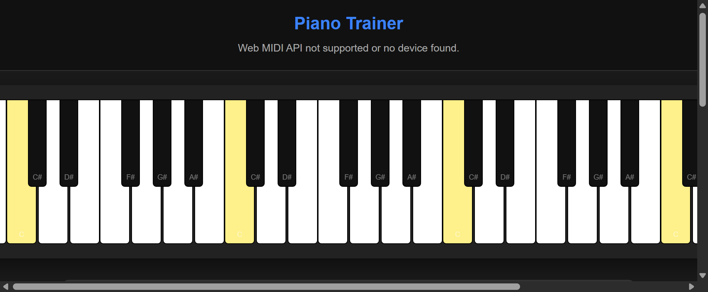
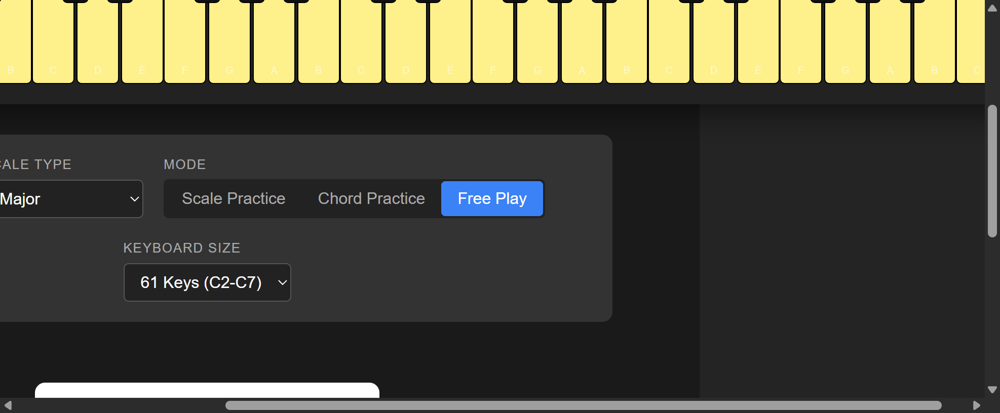
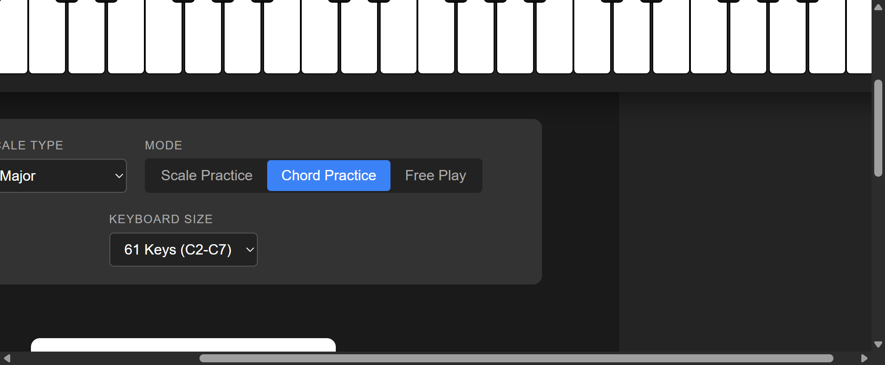
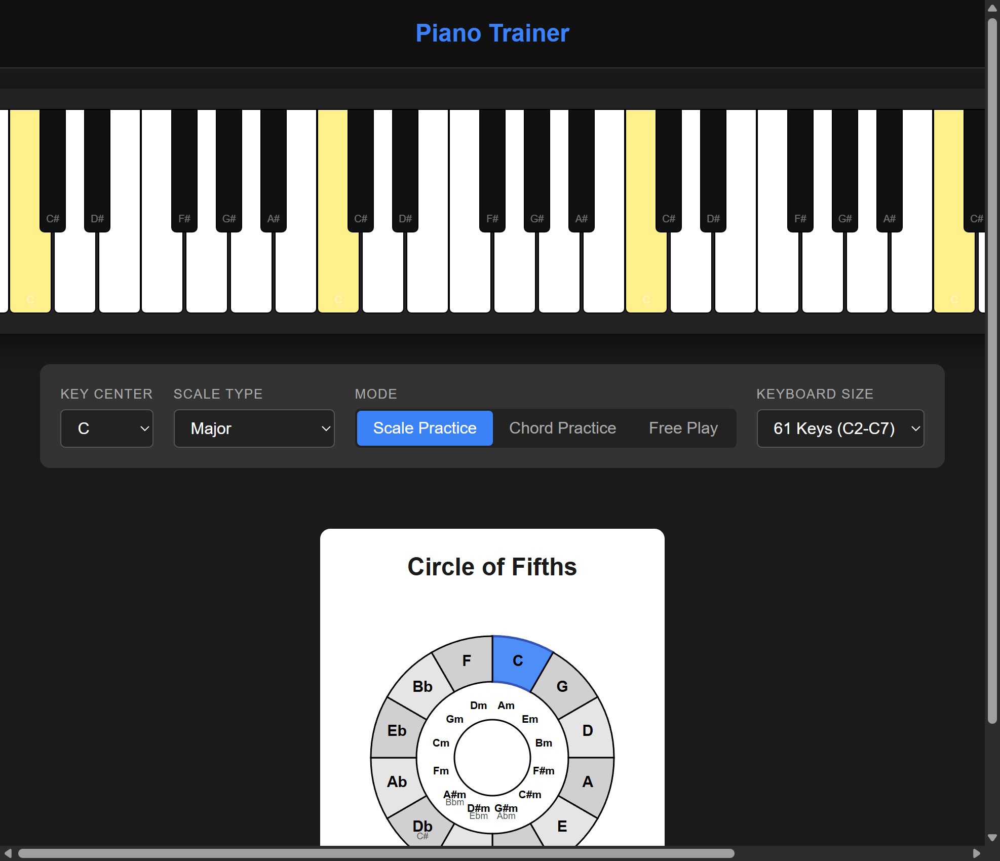

<!-- https://github.com/pleabargain/piano-app -->
# Piano App

Last updated: 2026-01-09

A React-based piano training application built with Vite. Practice scales, chords, and free play with MIDI keyboard support.

## Screenshots

### Main Application View

*Main interface showing piano keyboard and controls*

### Full Application Interface

*Complete view with Circle of Fifths and all controls*

### Free Play Mode with Circle of Fifths

*Free Play mode with real-time chord detection and Circle of Fifths*

### Chord Practice Mode

*Chord Practice mode with progression builder*

### Chord Practice with Detection

*Chord Practice mode showing target chord and detected chord side-by-side*

### Circle of Fifths and Chord Display

*Interactive Circle of Fifths with detected chord display frame positioned to the right*

## Getting Started

### Prerequisites

- Node.js (v16 or higher)
- npm or yarn

### Installation

1. Install dependencies:
```bash
npm install
```

### Running the Application

**Important**: This is a Vite project and must be run through Vite's development server. Do not open `index.html` directly in a browser.

To start the development server:
```bash
npm run dev
```

The app will be available at `http://localhost:5173` (or the port shown in the terminal).

### Building for Production

```bash
npm run build
```

The built files will be in the `dist` directory.

### Testing

Run unit tests:
```bash
npm test
```

Run tests with UI:
```bash
npm run test:ui
```

## Features

### Practice Modes

- **Scale Practice Mode**: 
  - Visual feedback shows which chord and inversion is currently displayed on the piano
  - Transposable progressions - practice the same progression in any key
  - **Key Progression Practice**: Practice scales in multiple keys sequentially
    - Set custom key progressions (e.g., "F C G D")
    - Automatic advancement to next key after completing each scale
    - Full octave scale practice (ascending and descending, 15 notes total)
    - Visual progression display showing current and upcoming keys
    - Loops through progression automatically for continuous practice

- **Free Play Mode**:
  - Play freely and see chord detection in real-time
  - Automatic chord identification with inversion detection
  - **Multiple Harmonic Functions**: When notes can be interpreted as multiple chords, all interpretations are shown (e.g., "A Minor 7 / C Major 6")
  - **Chord display frame**: Always-visible frame positioned next to Circle of Fifths
  - Shows detected chord name(s) and inversion when playing, or "No chord detected" when idle
  - Educational feedback showing what you're playing and all possible harmonic functions

- **Lava Game Mode**:
  - Fun, interactive game mode to practice staying in key
  - **Visual Key Indicators**: 
    - **Blue keys = Good keys** (notes in the selected scale - safe to play)
    - **Red keys = Lava keys** (notes NOT in the scale - avoid these!)
  - **Real-time Scoring System**: 
    - Scores update instantly as keys are pressed
    - Tracks good keys hit (notes in scale)
    - Tracks lava keys hit (notes out of scale)
    - Score display positioned next to Circle of Fifths showing both counts in real-time
  - **Continuous Gameplay**: No time limit - play as long as you want
  - Perfect for practicing scale awareness and avoiding wrong notes
  - Animated lava keys with glowing red effect for visual feedback

- **Recording and Playback**:
  - **Record Your Performance**: Capture MIDI performances with precise timing
  - **Playback Controls**: Play, pause, and stop recordings with progress tracking
  - **Play-Along Mode**: Visual highlighting shows which keys to play along with recordings
    - Purple highlighting with pulsing animation on expected keys
    - Real-time updates as the recording plays
    - Perfect for learning pieces by following visual guidance
  - **Wait for Input Mode**: Interactive learning where playback pauses at each note
    - Playback waits for you to play the correct note before advancing
    - Ideal for note-by-note learning of difficult passages
    - Can be combined with Play-Along Mode for maximum guidance
  - **Loop Playback**: Automatically repeat recordings for continuous practice
  - **Recording Management**: Save, load, and delete multiple recordings
  - **Local Storage**: Recordings persist across browser sessions

### Pyramid Layout (split-keyboard branch)

The application features an innovative pyramid layout for integrated chord and scale practice:

#### Layout Structure

```
         ┌─────────────────┐
         │ Circle of Fifths│  (Top - Centered, Scaled)
         └─────────────────┘
    
┌──────────┐  ┌──────────┐  ┌──────────┐
│Extensions│  │  Chord   │  │  Scale   │  (Middle Row)
│          │  │ Practice │  │ Selector │
└──────────┘  └──────────┘  └──────────┘

┌──────────────┐            ┌──────────────┐
│ Chord Piano  │            │ Scale Piano  │  (Bottom Row)
│  (C2-C4)     │            │  (C4-C6)     │
└──────────────┘            └──────────────┘
```

#### Three-Row Design

1. **Top Row**: Interactive Circle of Fifths (centered, 70% scale)
   - No title for clean appearance
   - Click any chord segment to highlight it
   - Automatically reflects locked chord root

2. **Middle Row**: Three Information Panels
   - **Extensions Panel (Left)**: Shows chord extensions and variations
   - **Chord Practice (Center)**: Main chord detection and locking
   - **Scale Selector (Right)**: Choose scales for practice

3. **Bottom Row**: Two Interactive Piano Keyboards
   - **Left Piano (C2-C4)**: Chord practice with chord highlighting
   - **Right Piano (C4-C6)**: Scale practice with scale note highlighting

#### Extensions Panel Features

- **Auto-Detection**: Shows available chord extensions when a chord is detected
- **Smart Suggestions**: Displays up to 4 extensions/variations
- **Note Display**: Shows which notes to add (e.g., "+B" for Major 7th)
- **Purple Theme**: Distinct visual styling for quick identification
- **Examples**: 
  - Playing C-E-G shows: C Major 7 (+B), C Major 9 (+B, D), etc.
  - Playing D-F#-A shows: D Major 7 (+C#), D Dominant 7 (+C), etc.

#### Chord Locking Feature

- **Lock Button** (🔓): Click to lock the currently detected chord
- **Locked Display**: Shows with green gradient background and lock icon (🔒)
- **Persistent Display**: Chord remains visible even when keys are released
- **Root Filtering**: Locked chord root automatically filters scale selection
- **Unlock Button**: Release the locked chord at any time
- **Practice Workflow**:
  1. Play a chord (e.g., D Major)
  2. Click "Lock Chord" button
  3. Circle of Fifths updates to show D as root
  4. Scale Selector filters to show only D-based scales
  5. Practice D Major, D Minor, D Blues, etc.
  6. Unlock to switch to a different chord

#### Chord Detection Features

- **Real-Time Detection**: Instantly identifies played chords
- **Multiple Harmonic Function Detection**: Shows all possible chord interpretations when the same notes can function as different chords
  - Example: Playing A, C, E, G displays "A Minor 7 / C Major 6" since both chords contain the same notes
  - Helps users understand equivalent chord voicings and harmonic functions
- **Inversion Display**: Shows chord inversions (Root, 1st, 2nd, 3rd)
- **Extension Suggestions**: Recommends 7th, 9th, and other extended chords
- **Visual Feedback**: Highlights chord notes on left piano
- **Supported Chord Types**:
  - Triads: Major, Minor, Diminished, Augmented
  - Suspended: Sus2, Sus4
  - 7th Chords: Major 7, Minor 7, Dominant 7, Diminished 7, Half Diminished 7
  - 6th Chords: Major 6, Add6
  - Extended Chords: 6/9, Add9, Major 9, Minor 9

#### Scale Selector Features

- **Root Note Filtering**: When chord is locked, only shows scales for that root
- **Locked Root Indicator**: Displays lock icon and root note (🔒 Root: D)
- **Scale Types Available**:
  - Major
  - Natural Minor
  - Harmonic Minor
  - Melodic Minor
  - Blues
- **Auto-Highlighting**: Selected scale notes highlighted on right piano
- **Info Messages**: Clear explanations of filtering behavior

#### Stable UI Design

- **Fixed Dimensions**: All panels have consistent min/max widths and heights
- **No Jumping**: UI remains stable when detecting chords or changing selections
- **Panel Sizes**:
  - Extensions: 240px width, 280px min-height
  - Chord Practice: 280px width, 280px min-height
  - Scale Selector: 280px width, 280px min-height

#### Integrated Practice Workflow Example

**Scenario: Learning D Major and its scales**

1. **Play D Major chord** (D-F#-A) on left piano
2. **View extensions** in left panel: D Major 7, D Dominant 7, etc.
3. **Lock the chord** using the lock button
4. **Circle of Fifths** highlights D as the root
5. **Scale Selector** filters to show: D Major, D Minor, D Harmonic Minor, D Blues
6. **Select D Major scale** from dropdown
7. **Right piano highlights** D Major scale notes (D-E-F#-G-A-B-C#-D)
8. **Practice the scale** on the right piano using the highlighted notes
9. **Switch to D Blues** for variety
10. **Unlock** when ready to practice a different chord/key


### Music Theory Features

- **Interactive Circle of Fifths**:
  - Traditional two-ring design matching standard music theory diagrams
  - **Outer ring**: Major keys with enharmonic equivalents (e.g., F#/Gb, Db/C#)
  - **Inner ring**: Relative minor keys with enharmonic equivalents
  - **Centered text labels**: All key names properly centered within their segments
  - Visual representation of the circle of fifths
  - Click any segment on the circle to instantly change the selected key
  - Highlights the currently selected key with blue color
  - Alternating light/dark segments for better visual distinction
  - Positioned alongside detected chord display for easy reference
  - **Dynamic Chord Animation**:
    - Real-time highlighting of the detected chord on the circle
    - **Active Major**: Dark blue highlighting for major chords
    - **Active Minor**: Light blue highlighting for minor chords
    - **Neighbor Highlighting**: Automatically highlights related keys (relative major/minor and adjacent fifths) to visualize harmonic relationships
  - Helps understand key relationships and music theory

- **Scale Support**: 
  - Major scales (all 12 keys)
  - Natural Minor scales
  - Harmonic Minor scales
  - Melodic Minor scales

- **Chord Detection**:
  - Major, Minor, Diminished, Augmented triads
  - Sus2, Sus4 (suspended) chords
  - Major 7, Minor 7, Dominant 7 chords
  - Diminished 7, Half Diminished 7 chords (all 12 roots supported)
  - Automatic inversion detection (Root Position, 1st, 2nd, 3rd Inversion)
  - **Chord Name Formats**: Supports multiple formats for chord names:
    - Full format: "C Major", "D diminished 7", "F# Sus2"
    - Short format: "Cm", "Cdim7", "F#sus4", "C°7" (diminished symbol)
    - Note: Flat roots (Bb, Eb, etc.) work best in full format ("Bb diminished 7")

- **Custom Chord Progressions**:
  - Input progressions using Roman numeral notation (e.g., "I IV V I")
  - Input validation for valid chord symbols
  - Preview progression in selected key showing both Roman numerals and chord names
  - Automatic transposition to any key
  - **Real-time chord detection**: Automatically detects when you play the correct target chord
  - **Automatic progression**: Advances to next chord after 500ms delay when correct chord is detected
  - **Chord name matching**: Handles both full format ("F Major") and short format ("F") for compatibility
  - **Inversion support**: Detects and displays chord inversions (Root Position, 1st, 2nd, 3rd)
  - **Visual feedback**: Shows target chord, detected chord, and progression status

### MIDI Integration

- **Web MIDI API Support**: Connect your MIDI keyboard or piano
- **Real-time Input Detection**: See which keys are being pressed
- **Visual Feedback**: Active notes highlighted on the virtual keyboard
- **Automatic Device Detection**: Connects to available MIDI devices
- **Device Name Display**: Connected MIDI device name shown in the header for easy identification

### Usage Ideas

- **Usage Ideas Link**: Click the "usage ideas" link in the header to access a comprehensive guide with creative ways to get the most out of the app
- **Scale Practice Tips**: Learn effective techniques for practicing scales, including using the Circle of Fifths, practicing in different octaves, and combining with metronomes
- **Chord Discovery**: Explore chord inversions, extensions, and progressions with detailed guidance
- **Play Along with Backing Tracks**: Instructions on how to use the app with external backing tracks for improvisation and practice

### Keyboard Visualization

- **Configurable Keyboard Sizes**:
  - 88 Keys (A0-C8) - Full piano range
  - 76 Keys (E1-G7)
  - 61 Keys (C2-C7) - Default
  - 49 Keys (C2-C6)
  - 25 Keys (C3-C5)

- **Visual Features**:
  - Highlighted scale notes (yellow highlighting)
  - Active MIDI notes display (blue when pressed)
  - **Interactive chord highlighting**: Click chord buttons to highlight specific chord keys in blue
  - **Lava Game visuals**: 
    - Red keys for out-of-scale notes (lava keys) with animated glowing effect
    - Blue keys for in-scale notes (good keys)
    - All keys in lava mode are either red or blue - no default colors
  - Note labels on keys
  - Color-coded feedback (correct/incorrect notes)
  - Centered layout for optimal viewing experience
  - **Chord Display**: Detected chords shown prominently in controls and status areas
  - **Real-time Score Display**: Lava game score updates instantly as keys are pressed

## Project Structure

```
piano-app/
├── src/
│   ├── components/           # React components
│   │   ├── Piano.jsx         # Virtual piano keyboard component
│   │   ├── Controls.jsx      # Settings and mode controls
│   │   ├── ProgressionBuilder.jsx  # Chord progression input
│   │   ├── KeyProgressionBuilder.jsx  # Key progression input for scale practice
│   │   ├── CircleOfFifths.jsx  # Interactive circle of fifths component
│   │   ├── ChordInfo.jsx     # Chord information and locking panel
│   │   └── ScaleSelector.jsx # Scale selection dropdown
│   ├── core/                 # Core music theory and MIDI logic
│   │   ├── music-theory.js   # Scale/chord calculations, chord detection
│   │   └── midi-manager.js   # Web MIDI API wrapper
│   ├── hooks/                # Custom React hooks
│   │   └── useChordDetection.js  # Chord detection hook
│   ├── test/                 # Unit tests
│   │   ├── App.test.jsx      # App component tests
│   │   └── main.test.jsx     # Entry point tests
│   ├── App.jsx               # Main app component with state management
│   ├── main.jsx              # React entry point
│   └── index.css             # Global styles
├── index.html                # HTML entry point
├── vite.config.js            # Vite configuration
├── vitest.config.js          # Vitest test configuration
└── agent-rules.md            # Coding rules and guidelines
```

## Usage Guide

### Getting Started

1. **Start the development server**:
   ```bash
   npm run dev
   ```

2. **Connect MIDI Keyboard** (optional):
   - When prompted, allow browser access to MIDI devices
   - Your MIDI keyboard will be automatically detected
   - If no MIDI device is available, you can still use the app visually

3. **Select Your Settings**:
   - **Key Center**: Choose the root note (C, C#, D, etc.)
   - **Scale Type**: Select Major, Natural Minor, Harmonic Minor, or Melodic Minor
   - **Mode**: Choose Scale Practice, Chord Practice, or Free Play
   - **Keyboard Size**: Adjust the virtual keyboard range

### Scale Practice

1. Select your desired key and scale type
2. Choose "Scale Practice" mode
3. The app will guide you to play each note of the scale in sequence
4. Play the highlighted target note to advance to the next note
5. Visual feedback shows correct/incorrect notes

#### Key Progression Practice

Practice scales in multiple keys sequentially with automatic progression:

1. **Set Up a Key Progression**:
   - Enter a series of keys separated by spaces (e.g., "F C G D")
   - Click "Set Progression" to activate
   - The progression will be displayed showing all keys with the current key highlighted in blue
   - Example progressions:
     - **Circle of Fifths**: `F C G D A E B`
     - **Common Practice**: `C G D A E B F#`
     - **Simple Start**: `F C G D`

2. **Practice Each Scale**:
   - The app automatically starts with the first key in your progression
   - Play the full octave scale (ascending and descending): C D E F G A B C B A G F E D C
   - The app guides you through each note sequentially
   - Visual feedback shows which note to play next

3. **Automatic Progression**:
   - When you complete a full scale cycle (all 15 notes), the app automatically advances to the next key
   - The progression display updates to highlight the new current key
   - Status message shows: "Scale complete! Next key: [Key] [Scale Type]"
   - The progression loops back to the first key after completing all keys

4. **Visual Feedback**:
   - **Current Key Display**: Shows which key you're currently practicing
   - **Progression Display**: Visual representation of all keys in your progression
   - **Current Key Highlight**: Blue highlight on the active key
   - **Upcoming Keys**: Gray display for keys not yet reached
   - **Status Messages**: Real-time feedback on your progress

5. **Clearing the Progression**:
   - Click "Clear" to remove the key progression
   - Returns to single-key scale practice mode
   - You can set a new progression at any time

6. **Tips for Effective Practice**:
   - Start with simple progressions (2-4 keys) before trying longer sequences
   - Use the Circle of Fifths order for systematic practice
   - Practice with a metronome for consistent timing
   - Focus on accuracy - precision is more important than speed
   - The app tracks your progress through each key automatically

### Chord Practice

Chord Practice mode helps you practice chord progressions with real-time detection and automatic advancement.

#### Setting Up a Chord Progression

1. **Select "Chord Practice" mode** from the mode buttons
2. **Create a Progression**:
   - In the **Custom Progression** panel (positioned to the right of the Detected Chord display):
     - Enter a chord progression using Roman numerals (e.g., "I IV V I" or "I - IV - V - I") or absolute chord names (e.g., "C F G C" or "C - F - G - C")
     - Click "Set Progression" to activate it
     - The progression will be displayed below the input with both Roman numerals and chord names
     - Example: For F Major key, "I IV V I" becomes: I (F Major), IV (A# Major), V (C Major), I (F Major)

#### Understanding the Layout

The Chord Practice interface has several key areas:

- **Chord Practice Panel** (Center): Shows chord practice information
  - **Currently Playing**: Displays the chord you're currently playing with name and inversion
  - **Target Chord**: Shows the current chord you need to play (highlighted when practice is active)
  - **Next Chord**: Shows the next chord in the progression (appears when practice is active)
  - Shows "Play a chord to detect" when idle
  - Shows "Playing... (no chord detected)" when notes are pressed but no chord is detected
  - Displays ✅ checkmark and green highlight when correct chord is played

- **Custom Progression Panel** (Right side): 
  - Input field for entering Roman numeral progressions
  - Preview of the progression with clickable chord buttons
  - Each chord button shows both Roman numeral and chord name
  - **Visual Highlighting During Practice**:
    - Current target chord is highlighted in **yellow/gold**
    - Next chord is highlighted in **blue** with pulsing animation
    - Highlights update automatically as you progress through the progression

- **Target Chord Display** (Below controls): 
  - Shows the current target chord you need to play
  - Displays both Roman numeral (e.g., "I") and chord name (e.g., "F Major")
  - Updates automatically as you progress through the sequence

- **Detected Chord Card** (Below target): 
  - Shows the chord you're actually playing
  - Displays chord name and inversion
  - Only appears when a chord is detected

#### How Chord Detection Works

1. **Play the Target Chord**:
   - The app requires you to play **all 3 notes** of a triad simultaneously (or at least have them all active)
   - For example, to play F Major, press F, A, and C together
   - The app detects chords based on pitch classes, so any octave works

2. **Automatic Detection**:
   - As soon as you play 3+ notes that form a chord, the app detects it
   - The detected chord appears in the "Currently Playing" display
   - The app compares the detected chord name to the target chord name

3. **Practice Mode Features**:
   - **Visual Feedback**: When you begin practicing, the progression display highlights:
     - **Current Target Chord**: Highlighted in **yellow/gold** - this is the chord you need to play next
     - **Next Chord**: Highlighted in **blue** with a pulsing animation - shows what comes after the current chord
   
   - **Chord Acknowledgment**: 
     - When you play the **correct target chord**, you'll see:
       - ✅ Checkmark appears next to the detected chord name
       - Status message shows: "✅ Correct! Next: [Roman] ([Chord Name])"
       - The current chord display briefly pulses green to confirm correctness
       - After 1.5 seconds, the app automatically advances to the next chord
   
   - **Automatic Progression**:
     - When you play the correct target chord, the app automatically advances to the next chord
     - The progression loops back to the first chord after completing all chords
     - The highlighted chords update automatically as you progress
     - Practice mode activates automatically when you start playing chords

4. **Target and Next Chord Display**:
   - In the **Chord Practice** panel (center), you'll see:
     - **Target Chord**: Shows the current chord you need to play (e.g., "I (C Major)")
     - **Next Chord**: Shows what comes next in the progression (e.g., "IV (F Major)")
   - These displays update in real-time as you progress through the progression

#### Exploring Chord Inversions

- **Click any chord button** in the progression preview to see its keys highlighted on the piano
- The piano keys will light up in blue showing exactly which keys to play for that chord
- **Cycle through inversions**: Click the same chord button again to see the next inversion
- Each click cycles through: Root Position → 1st Inversion → 2nd Inversion → 3rd Inversion → (back to Root)
- A display appears showing which chord and inversion is currently highlighted
- This helps you learn different voicings and fingerings for the same chord

#### Tips for Effective Practice

- **Play all notes together**: The app detects chords when all required notes are active simultaneously
- **Hold the chord**: Keep the chord pressed for at least 500ms to ensure detection and advancement
- **Watch the displays**: 
  - Check "Detected Chord" to see what the app recognizes
  - Check "Target" to see what you should play next
  - The status message provides real-time feedback
- **Practice in different keys**: Change the key center to practice the same progression in different keys
- **Use inversions**: Click chord buttons to explore different voicings and fingerings
- **Note**: The UI layout could be improved, but the core functionality works correctly

#### Known Limitations

- **UI Layout**: The current layout has the Detected Chord and Custom Progression side-by-side, which may feel cramped on smaller screens
- **Visual Feedback**: While chord detection works, the visual feedback could be more prominent
- **Error Handling**: If you play the wrong chord, the app doesn't provide explicit feedback - it just doesn't advance
- **Chord Requirements**: You must play complete triads (3 notes minimum) - partial chords won't be detected

### Free Play

1. Select "Free Play" mode
2. The chord display frame appears next to the Circle of Fifths (always visible)
3. Play any combination of notes on your MIDI keyboard
4. The app automatically detects and displays:
   - Chord name (e.g., "C Major", "D Minor 7", "F# Diminished 7")
   - Chord inversion (e.g., "Root Position", "1st Inversion")
   - All chord types are detected across all 12 keys and octaves
5. When no chord is detected, the frame shows "No chord detected"
6. Scale notes are highlighted for reference on the keyboard
7. Use the Circle of Fifths to quickly change keys while playing

### Lava Game

1. Select your desired key and scale type (e.g., "C Major")
2. Choose "Lava Game" mode
3. **Visual Guide**:
   - **Blue keys = Good keys** (safe to play - these are in your selected scale)
   - **Red keys = Lava keys** (avoid these - they're NOT in your scale!)
4. **Gameplay**:
   - Play continuously on your MIDI keyboard
   - Try to hit only the blue (good) keys
   - Avoid the red (lava) keys
   - No time limit - play as long as you want
5. **Real-time Scoring**:
   - Score display positioned next to Circle of Fifths shows two counters:
     - **Good Keys**: Number of correct scale notes hit (displayed in blue)
     - **Lava Keys Hit**: Number of wrong notes (out of scale) hit (displayed in red)
   - **Scores update instantly** as you press keys - no delay
   - Watch your score change in real-time as you play
6. **Practice Tips**:
   - Start with a simple scale (like C Major) to get familiar
   - Focus on staying in key and avoiding the lava keys
   - Challenge yourself by trying different keys and scale types
   - Great for developing muscle memory and scale awareness

### Recording and Playback

The app includes a comprehensive recording and playback system that allows you to record your performances and practice along with them.

#### Recording Your Performance

1. **Start Recording**:
   - Click the "⏺ Record" button in the Recording Controls panel
   - Play your piece on your MIDI keyboard
   - The recording duration is displayed in real-time
   - Optionally enter a name for your recording while recording

2. **Stop Recording**:
   - Click the "⏹ Stop" button to end the recording
   - Your recording is automatically saved to local storage
   - The recording appears in the Recording List for future playback

3. **Recording Features**:
   - Captures all MIDI events (note on/off, velocity, timing)
   - Preserves exact timing and note durations
   - Multiple recordings can be saved and managed
   - Recordings persist across browser sessions

#### Playing Back Recordings

1. **Select a Recording**:
   - Browse your saved recordings in the Recording List
   - Click on a recording to load it for playback
   - The selected recording is highlighted

2. **Playback Controls**:
   - **▶ Play**: Start playback from the beginning
   - **⏸ Pause**: Pause playback (resume with Play button)
   - **⏹ Stop**: Stop playback and return to the beginning
   - **Progress Bar**: Shows playback progress as a percentage

3. **Playback Features**:
   - Accurate timing reproduction of your original performance
   - Visual progress indicator
   - Can be paused and resumed at any time
   - Works with all practice modes

#### Play-Along Mode

Play-Along Mode helps you practice by visually showing which keys to play along with a recording.

1. **Enable Play-Along Mode**:
   - Load a recording from the Recording List
   - Check the "Play-Along Mode" checkbox in the Recording Controls
   - Start playback of your recording

2. **Visual Feedback**:
   - **Purple Highlighting**: Keys that are being played in the recording are highlighted in purple
   - **Pulsing Animation**: Expected keys have a subtle pulsing animation to draw attention
   - **Real-time Updates**: Highlights update in real-time as the recording plays
   - **Multiple Keys**: All active notes from the recording are highlighted simultaneously

3. **How It Works**:
   - As the recording plays, each note that sounds is highlighted on the piano keyboard
   - You can see exactly which keys to play along with
   - Highlights appear when notes start and disappear when notes end
   - Perfect for learning pieces by following along visually

4. **Practice Tips**:
   - Start by just watching the highlights to understand the piece
   - Try playing along with the recording to practice timing
   - Use it to learn new pieces by following the visual guide
   - Combine with other modes (like Free Play) to see chord detection while playing along

#### Wait for Input Mode

Wait for Input Mode creates an interactive learning experience where playback pauses and waits for you to play the correct note.

1. **Enable Wait for Input Mode**:
   - Load a recording from the Recording List
   - Check the "Wait for Input Mode" checkbox
   - Start playback of your recording

2. **How It Works**:
   - Playback automatically pauses at each note
   - The expected note is highlighted in purple on the keyboard
   - You must play the correct note to continue playback
   - If you play the wrong note, playback remains paused (no error message, but it won't advance)
   - Once you play the correct note, playback automatically continues to the next note

3. **Learning Benefits**:
   - Forces you to learn each note individually
   - Helps develop muscle memory for specific pieces
   - Perfect for learning difficult passages note-by-note
   - Self-paced learning - take your time on each note

4. **Combining with Play-Along Mode**:
   - You can enable both Play-Along Mode and Wait for Input Mode together
   - Play-Along Mode shows you which note to play
   - Wait for Input Mode ensures you play it correctly before advancing
   - This combination provides the most guided learning experience

#### Loop Playback

Loop Playback automatically repeats your recording for continuous practice.

1. **Enable Loop Playback**:
   - Load a recording from the Recording List
   - Check the "Loop Playback" checkbox
   - Start playback - the recording will automatically restart when it reaches the end

2. **Use Cases**:
   - Practice a piece repeatedly without manually restarting
   - Use with Play-Along Mode for continuous visual guidance
   - Perfect for memorization and muscle memory development
   - Great for warm-up exercises or technical drills

3. **Stopping Loops**:
   - Click the "⏹ Stop" button to stop playback and exit loop mode
   - Uncheck the "Loop Playback" checkbox to disable looping

#### Recording Management

1. **Recording List**:
   - All your saved recordings are displayed in the Recording List
   - Each recording shows its name and creation date
   - Click on a recording to load it for playback
   - Recordings are stored in your browser's local storage

2. **Deleting Recordings**:
   - Each recording has a delete button
   - Click to permanently remove a recording
   - Deletion cannot be undone

3. **Recording Storage**:
   - Recordings are saved locally in your browser
   - They persist across browser sessions
   - Clearing browser data will remove recordings
   - Consider exporting important recordings if needed

#### Tips for Effective Practice

- **Record Yourself**: Record your practice sessions to track progress over time
- **Play Along**: Use Play-Along Mode to learn new pieces by following the visual guide
- **Slow Learning**: Use Wait for Input Mode to learn difficult passages note-by-note
- **Repetition**: Use Loop Playback to practice passages repeatedly
- **Combine Modes**: Try different combinations of modes to find what works best for you
- **Record Variations**: Record different versions of the same piece to compare approaches

## Browser Compatibility

- **Chrome/Edge**: Full Web MIDI API support ✅
- **Firefox**: Limited MIDI support (may require polyfill)
- **Safari**: Limited MIDI support (may require polyfill)

**Note**: For best experience, use Chrome or Edge browser.

## Troubleshooting

### Chord Detection Not Working

If chord detection isn't working in Chord Practice mode:

1. **Check MIDI Connection**: Ensure your MIDI keyboard is connected and the browser has permission to access it
2. **Play Complete Chords**: The app requires at least 3 notes played simultaneously to detect a chord
3. **Check Target Chord**: Verify you're playing the correct target chord shown in the "Target" display
4. **Hold the Chord**: Keep the chord pressed for at least 500ms to ensure detection and advancement
5. **Check Chord Name Match**: The detected chord name must exactly match the target chord name (e.g., "F Major" = "F Major")
6. **Verify Progression is Set**: Make sure you've clicked "Set Progression" after entering your Roman numeral progression

### Common Issues

- **"No chord detected"**: You may be playing fewer than 3 notes, or the notes don't form a recognized chord
- **Chord not advancing**: The detected chord name doesn't match the target chord name - check for exact match
- **UI feels cramped**: The current layout places multiple panels side-by-side - this is a known UI limitation but functionality works correctly
- **Status message not updating**: Check that you're in the correct mode (Chord Practice) and have set a progression

### Killing Vite Development Server Instances

If you need to stop all running Vite instances (for example, if the dev server is stuck or you have multiple instances running):

**Windows PowerShell Users:**

Run this command in PowerShell to kill all Node.js processes running Vite:

```powershell
# Get all node processes and filter by command line containing "vite"
Get-CimInstance Win32_Process -Filter "name = 'node.exe'" | 
    Where-Object { $_.CommandLine -like "*vite*" } | 
    ForEach-Object { Stop-Process -Id $_.ProcessId -Force }
```

This command will:
- Find all Node.js processes
- Filter to only those with "vite" in their command line
- Forcefully stop those processes

**Note**: This is specifically for Windows users using PowerShell. On other operating systems, use `Ctrl+C` in the terminal where Vite is running, or use platform-specific process management commands.

## Development

See `agent-rules.md` for coding rules and guidelines.

---

## UI/Design

- **Centered Layout**: The application interface is centered both horizontally and vertically in the browser for optimal viewing experience
- **Responsive Design**: Adapts to different screen sizes while maintaining centered layout
- **Dark Theme**: Modern dark theme optimized for extended practice sessions
- **Max Width**: Content is constrained to a maximum width of 1400px for better readability on large screens
- **Real-time Feedback**: Chord detection displayed in multiple areas:
  - **Detected Chord Display**: Positioned to the left, shows chord name and inversion when playing
  - **Custom Progression Panel**: Positioned to the right of Detected Chord, allows input and preview
  - **Target Chord Card**: Below controls, shows current target chord (Roman numeral and name)
  - **Detected Chord Card**: Below target, shows what chord you're actually playing
  - Displays "No chord detected" placeholder when idle
- **Circle of Fifths**: White background with traditional two-ring design for clear visibility
- **Layout Notes**: 
  - The current UI layout works functionally but could be improved for better usability
  - Chord Practice mode displays multiple information panels side-by-side which may feel cramped
  - All core functionality works correctly despite UI limitations

### UI Improvement Opportunities

While the application is fully functional, there are several areas where the user interface could be enhanced for better usability and user experience:

#### Layout and Spacing

- **Chord Practice Mode Layout**: 
  - Currently displays Detected Chord and Custom Progression panels side-by-side, which can feel cramped on smaller screens
  - **Improvement**: Consider a vertical stack layout or collapsible panels for better space utilization
  - **Improvement**: Add responsive breakpoints to switch between horizontal and vertical layouts based on screen size

- **Information Hierarchy**:
  - Multiple chord displays (Detected Chord, Target Chord, Detected Chord Card) can be confusing
  - **Improvement**: Consolidate or better differentiate between different chord information displays
  - **Improvement**: Use visual hierarchy (size, color, position) to emphasize the most important information

- **Panel Spacing**:
  - Some panels feel tightly packed together
  - **Improvement**: Increase consistent spacing between panels and sections
  - **Improvement**: Add visual separators or subtle borders to better define sections

#### Visual Feedback

- **Chord Detection Feedback**:
  - While chord detection works correctly, visual feedback could be more prominent
  - **Improvement**: Add animation or color transitions when a chord is detected
  - **Improvement**: Use more distinct visual states for "correct chord", "wrong chord", and "no chord"
  - **Improvement**: Add success indicators (checkmarks, color changes) when progression advances

- **Error States**:
  - Currently, playing the wrong chord in Chord Practice mode doesn't provide explicit feedback
  - **Improvement**: Add visual indicators (red highlighting, shake animation) when wrong chord is played
  - **Improvement**: Show helpful hints about what notes are missing or incorrect

- **Status Messages**:
  - Status messages could be more visually prominent
  - **Improvement**: Use toast notifications or more prominent status banners
  - **Improvement**: Add icons or color coding to different types of status messages

#### Component Organization

- **Controls Panel**:
  - Settings and mode controls could be better organized
  - **Improvement**: Group related controls into collapsible sections
  - **Improvement**: Add tooltips or help text for less obvious controls
  - **Improvement**: Consider a settings panel that can be toggled open/closed

- **Recording Controls**:
  - Recording controls and list could be better integrated
  - **Improvement**: Create a unified recording panel with better visual organization
  - **Improvement**: Add visual indicators for recording state (recording, paused, stopped)

- **Mode Selection**:
  - Mode buttons could be more visually distinct
  - **Improvement**: Use icons or more distinct styling for each mode
  - **Improvement**: Add visual indicators showing which mode is currently active

#### Responsive Design

- **Mobile/Tablet Support**:
  - Current layout may not work well on smaller screens
  - **Improvement**: Add mobile-specific layouts with stacked components
  - **Improvement**: Make piano keyboard scrollable or resizable on smaller screens
  - **Improvement**: Consider touch-friendly button sizes and spacing

- **Large Screen Optimization**:
  - On very large screens, content may feel too centered and underutilized
  - **Improvement**: Add options for different layout modes (centered, full-width, custom)
  - **Improvement**: Allow users to customize panel arrangements

#### Accessibility

- **Keyboard Navigation**:
  - Keyboard shortcuts and navigation could be improved
  - **Improvement**: Add keyboard shortcuts for common actions (start/stop recording, change modes)
  - **Improvement**: Ensure all interactive elements are keyboard accessible

- **Screen Reader Support**:
  - Better ARIA labels and semantic HTML could improve accessibility
  - **Improvement**: Add proper ARIA labels to all interactive elements
  - **Improvement**: Ensure status messages are announced to screen readers

- **Color Contrast**:
  - Some text/background combinations may not meet accessibility standards
  - **Improvement**: Review and improve color contrast ratios throughout the application
  - **Improvement**: Add high-contrast mode option

#### User Experience Enhancements

- **Onboarding**:
  - New users may find the interface overwhelming
  - **Improvement**: Add a welcome tour or tutorial for first-time users
  - **Improvement**: Add contextual help tooltips throughout the interface

- **Customization**:
  - Limited options for personalizing the interface
  - **Improvement**: Add theme customization (light/dark mode toggle)
  - **Improvement**: Allow users to show/hide certain panels
  - **Improvement**: Save user preferences (layout, theme, default settings)

- **Visual Polish**:
  - Some components could benefit from more refined styling
  - **Improvement**: Add subtle shadows, gradients, or other visual effects for depth
  - **Improvement**: Improve button hover states and transitions
  - **Improvement**: Add loading states and smooth transitions between states

#### Information Display

- **Chord Information**:
  - Chord extension suggestions could be more visually integrated
  - **Improvement**: Show extensions as clickable buttons that highlight keys on the piano
  - **Improvement**: Add visual connections between chord notes and extension suggestions

- **Progression Display**:
  - Progression preview could be more interactive
  - **Improvement**: Add visual indicators showing progress through the progression
  - **Improvement**: Show which chords have been completed vs. upcoming

- **Recording List**:
  - Recording list could show more information
  - **Improvement**: Add thumbnails or previews of recordings
  - **Improvement**: Show duration, date created, and other metadata more prominently
  - **Improvement**: Add search/filter functionality for recordings

#### Performance and Polish

- **Animations**:
  - Smooth animations could improve perceived performance
  - **Improvement**: Add subtle transitions when switching modes or updating displays
  - **Improvement**: Smooth animations for chord detection feedback

- **Loading States**:
  - Some operations may benefit from loading indicators
  - **Improvement**: Add loading spinners for recording playback initialization
  - **Improvement**: Show progress indicators for long operations

These improvements would enhance the user experience while maintaining the application's core functionality. The current implementation prioritizes functionality over polish, which is appropriate for a working application, but these enhancements would make it more user-friendly and professional.

## Technical Details

### Music Theory Implementation

- **Scale Calculation**: Uses interval patterns to generate scales
- **Chord Detection**: Analyzes pitch classes to identify chord types and inversions
- **Roman Numeral Analysis**: Converts chord progressions to Roman numeral notation
- **Note Normalization**: Handles enharmonic equivalents (C# = Db)

### MIDI Implementation

- Uses Web MIDI API (`navigator.requestMIDIAccess`)
- Tracks active notes in real-time
- Supports multiple MIDI input devices
- Handles MIDI device connection/disconnection events

### Prerequisites

- A browser that supports the **Web MIDI API** (Chrome, Edge, or Opera).
- A MIDI keyboard or controller connected to your computer.
- **IMPORTANT**: Some MIDI models (especially Yamaha) require specific USB/MIDI drivers (e.g., **Yamaha Steinberg USB Driver**) to be installed on your operating system for the browser to detect the device.

---

### Testing

The project includes comprehensive unit tests for:
- App component rendering
- Root element mounting
- Music theory functions (scales, chords)
- MIDI manager functionality
- **Chord detection logic**: Tests for F Major, C Major, Sus2, Sus4, Diminished 7, and other chord types
- **Chord practice integration**: Tests for chord name matching and progression advancement
- **Key progression practice**: Tests for scale progression functionality
- **Chord name format consistency**: Ensures identifyChord and progression builder use matching formats

Run tests with `npm test` or `npm run test:ui` for interactive test interface.

**Test Coverage Highlights**:
- 33+ tests specifically for sus2 and sus4 chord detection
- 33+ tests for chord detection and practice mode
- Tests verify chord detection works across different octaves and inversions
- Tests ensure chord name matching works correctly for progression advancement
- Edge cases covered: insufficient notes, wrong chords, partial chords, empty inputs, enharmonic equivalents
- Diminished 7 chords: All 12 roots supported with enharmonic equivalence handling
- **Multiple Harmonic Function Detection**: Tests for detecting all possible chord interpretations (e.g., Am7/C6 case)
- **New Chord Types**: Tests for Major 6, Add6, 6/9, Add9, Major 9, and Minor 9 chord detection

---

## Recent Updates

### 2026-01-10: Enhanced Chord Practice with Visual Feedback

Added comprehensive visual feedback and progression tracking for Chord Practice mode:

- **Visual Chord Highlighting**: 
  - Current target chord highlighted in **yellow/gold** in the progression display
  - Next chord highlighted in **blue** with pulsing animation
  - Highlights update automatically as you progress through the progression

- **Chord Acknowledgment**:
  - ✅ Checkmark appears when correct chord is played
  - Green highlight animation confirms correct chord detection
  - Status message shows "✅ Correct! Next: [chord]" for clear feedback

- **Target and Next Chord Display**:
  - Chord Practice panel now shows "Target Chord" and "Next Chord" sections
  - Displays both Roman numeral and chord name (e.g., "I (C Major)")
  - Updates in real-time as you progress through the progression

- **Automatic Practice Mode Activation**:
  - Practice mode activates automatically when you start playing chords
  - Visual indicators appear when a progression is set and practice begins
  - Enhanced user experience with clear guidance on what to play next

This enhancement makes chord practice more intuitive and provides clear visual feedback throughout the practice session.

### 2025-12-22: Multiple Harmonic Function Detection

Added support for detecting and displaying multiple harmonic functions when the same set of notes can be interpreted as different chords:

- **New Function**: `identifyAllChords()` returns all possible chord interpretations for a set of notes
- **UI Enhancement**: Chord display now shows all interpretations separated by " / " (e.g., "A Minor 7 / C Major 6")
- **New Chord Types**: Added support for Major 6, Add6, 6/9, Add9, Major 9, and Minor 9 chords
- **Backward Compatibility**: `identifyChord()` still returns the first match for existing code
- **Example**: Playing A, C, E, G now shows both "A Minor 7" and "C Major 6" since they contain the same notes

This enhancement helps users understand that the same notes can function as different chords depending on harmonic context, improving music theory education.

---

## Current Status

**2026-01-09**: Currently working on implementing local file saving functionality for chord progressions. The application allows users to create and save chord progressions to IndexedDB, but there have been issues with exporting/saving these progressions to local files. 

**Current Issue**: Users are experiencing failures when attempting to save progressions locally. The File System Access API (`showSaveFilePicker`) is being used to provide a native file save dialog, but edge cases and error handling need improvement.

**Testing Note**: Composer from Cursor has demonstrated difficulty writing unit tests that effectively isolate bugs, particularly for UI-related issues and browser API interactions. When debugging, it's important to:
- Write granular tests that test individual functions/components in isolation
- Mock browser APIs thoroughly (File System Access API, URL.createObjectURL, etc.)
- Test error paths and edge cases explicitly
- Verify both success and failure scenarios

---

## Development Notes

**2026-01-11**: I'm very proud of this iteration. Can now load `G Am C F Dm Em` as a sample chord progression. Minors and diminished chords will be tested soon.

**TODO**: Add more screenshots

---

Last Updated: 2026-01-11
